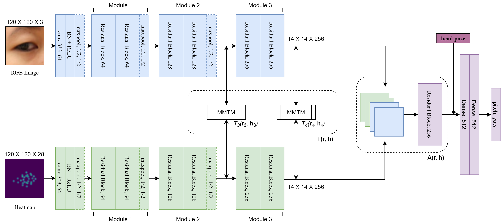

# FLAME
Original Pytorch Implementation of FLAME: Facial Landmark Heatmap Activated Multimodal Gaze Estimation, accepted at the 17th IEEE Internation Conference on Advanced Video and Signal-based Surveillance, AVSS 2021, Virtual, November 16-19, 2021.

arXiv Preprint: [arXiv](https://arxiv.org/abs/2110.04828)

## Dependencies used
- python v3.6.13
- cuda v10.2
- numpy v1.19.2
- pandas v1.1.3
- opencv-python-headless v4.5.1.48 (or use equivalent opencv)
- torch v1.8.0
- torchvision v0.9.0
- scipy v1.5.2
- matplotlib v3.3.4

## FLAME - Model and Results

**Model Architecture for FLAME** -




**Results** -

| Experimental Settings| ColumbiaGaze | EYEDIAP |
|--|--|--|
| FLAME | mean = 4.64°, std = 2.86° | mean = 4.62°, std = 2.93°|
| F-AO | mean = 5.06°, std = 3.13° | mean = 4.80°, std = 3.02°|
| F-AF | mean = 5.88°, std = 3.06° | mean = 5.30°, std = 3.03°|
| F-B | mean = 5.93°, std = 3.20°| mean = 5.32°, std = 3.08°|

## Project Installation

This code requires Python 3, Pytorch, Cuda and other dependencies as listed above. Open Command Prompt/Terminal and use the following commands to clone the project and install dependencies (python, pip are prerequisites) -
```
$ git clone https://github.com/neelabhsinha/flame.git
$ cd flame
$ pip3 install -r requirements.txt
$ python3 main.py -h
```
Alternatively you can install the above dependencies in your environment as you prefer. The exact versions used in this project are listed above.
To be able to do necessary data preprocessing, you would also optionally require [Openface 2.0](https://github.com/TadasBaltrusaitis/OpenFace) (or any other 2D landmark extractor) and [RetinaFace](https://github.com/serengil/retinaface) (or any other way to extract face crops). These are optional requirements and feel free to use any other toolkit to achieve the required objective. For more details read through the section 'Preparing the dataset'.

## Project Description

Files in the project are described in the following table - 

|File|Description|
|--|--|
|[datasets/data.py](datasets/data.py)|Contains dataset class and sampler class used by the data loader in training/testing loop to generate data samples (edit this if you organize the data differently as compared to how it is mentioned in 'preparing the dataset' section).|
|[losses/angular_loss.py](losses/angular_loss.py)|Pytorch definition of 3D angular loss function used for evaluations.|
|[losses/vector_loss.py](losses/angular_loss.py)|Pytorch definition of vector difference loss function used for training.|
|[models](models)|Contains Pytorch definition of models proposed in the paper as defined in the table below.|
|[metadata](metadata)|Contains dataset metadata like split, max-min values as explained in the below sections.|
|[utils/data_split.py](utils/data_split.py)|Contains function to split the data into train, test and validation sets and save it at the desired place (see 'optional configurations' section below for details).|
|[utils/helpers.py](utils/helpers.py)|Contains function to crop eye sample randomly, used by the dataset class in [datasets/data.py](datasets/data.py), and function that generates heatmap, used by get_and_save_heatmap function in [utils/data_preprocess.py](utils/preprocess.py) (all functions defined here are used by other functions and need not be used directly by the programmer).|
|[utils/preprocess.py](utils/preprocess.py)|Contains preprocessing functions, like getting head_pose angles from rotation matrix, outermost method to extract 2D facial landmark heatmap for entire dataset, get max-min values of different modalities of a dataset, and a few helper functions (see 'optional configurations' and 'preparing the dataset' sections below for more details).|
|[utils/train.py](utils/train.py)|Contains 2 functions, one function to train the network containing training loop and related functionalities like loading a checkpoint, saving epoch results, and another method incorporating the entire forward pass pipeline which can be used for training, testing, and for any other purpose as desired (see 'training' section below for details).|
|[utils/test.py](utils/test.py)|Contains method that runs evaluations on test set of a data and saves the predictions (see 'evaluations/testing' section below).|
|[config.py](config.py)|Contains configuration veriables like dataset paths, project path, path to store weights, logs, and training hyperparameters like maximum epoch, batch size. Edit this file before running the project with appropriate paths.|
|[main.py](main.py)|Contains main code that drives the entire project as per arguments provided (details are explained in following sections).|

Each model as described in the paper is identified with a unique key in this code which we shall address by **model_id** in this readme. The keys to those models along with the pretrained checkpoints (containing model weights, and other variables related to the final state) are given in the table below -

|Model Name | Model ID (model_id) | Model definition | Columbiagaze Checkpoint | EYEDIAP Checkpoint|
|-----------|-----------------------|------------------|--------------------|------------------------|
|FLAME|mmtm-fusion|[models/mmtm_fusion.py](models/mmtm_fusion.py)| [Checkpoint](https://drive.google.com/file/d/1jPq5LfmlS0fLVNLNAs0vuipC44MMj5Vg/view?usp=sharing) | [Checkpoint](https://drive.google.com/file/d/1CPsBRA9DppCpQjYyBxmYmdvzGAUcKz14/view?usp=sharing)|
|F-AO|concatenated-fusion|[models/aggregation_only.py](models/aggregation_only.py)| TBA | TBA|
|F-AF|additive-fusion|[models/additive_fusion.py](models/additive_fusion.py)| TBA | TBA|
|F-B|baseline|[models/baseline.py](models/baseline.py)| TBA | TBA|

The format of these checkpoints is in the form of dictionary with following schema -

```
{
  'epoch': epoch number, 
  'model_state_dict': model_weights, 
  'optimizer_state_dict': optimizer state,
  'scheduler_state_dict': scheduler_state,
  'loss_train': mean_training_loss, 
  'loss_cv': mean_cv_loss
}
```

## Prepraring the dataset

Prepare a directory structure as the following and add the root in the dataset_paths dictionary in [config.py](config.py).
```
dataset_root
│
└───images
│   │───subject01
│   │   │   1.npy
│   |   │   2.npy
│   |   │   ...
│   │
│   └───subject02
│   |   │   1.npy
│   |   │   2.npy
│   |   │   ...
│   |....
│   
└───heatmaps
│   │───subject01
│   │   │   1.npy
│   |   │   2.npy
│   |   │   ...
│   │
│   └───subject02
│   |   │   1.npy
│   |   │   2.npy
│   |   │   ...
│   |....
|
└───facial_landmarks_2d
│   │───subject01.pkl
│   |───subject02.pkl
|   |....
│   
|
└───head_pose
│   │───subject01.pkl
│   |───subject02.pkl
|   |....
│   
└───gaze_target
│   │───subject01.pkl
│   |───subject02.pkl
|   |....
│   
```
- images - RGB images as numpy arrays with dimension (height, width, channels) of the complete face crop. Stored as one folder for each subject, and images of the particular subject contained inside as numpy arrays.
- heatmaps - 2D landmark heatmaps as numpy arrays with dimension (height, width, channels) of the complete face crop. Stored as one folder for each subject, and images of the particular subject contained inside as numpy arrays.
- facial_landmarks_2d - 2D facial landmarks in the form of numpy arrays saved as pickle (index i of a file contains data corresponding to (i+1)th image and heatmap file inside the given subject folder with the same name as that of the pickle file).
- head_pose - Head pose angles in the form of numpy arrays of the type [pitch, yaw, roll] angle numpy arrays (index i of a file contains data corresponding to (i+1)th image and heatmap file inside the given subject folder with the same name as that of the pickle file). If not available, headpose can be used from the output of [Openface 2.0](https://github.com/TadasBaltrusaitis/OpenFace).
- gaze_angles - Gaze angles in the form of numpy arrays of the type [yaw, pitch] angle numpy arrays (index i of a file contains data corresponding to (i+1)th image and heatmap file inside the given subject folder with the same name as that of the pickle file). This is the ground truth.

Steps - 
1. Extract Face crops from [RetinaFace](https://github.com/serengil/retinaface) and zero-pad them to nearest 4:5 ratio (or any other way to extract face crops).
2. Crop them to 384 * 450 pixels. The dimension of RGB images, hence, will be 384\*450\*3.
3. Run [Openface 2.0](https://github.com/TadasBaltrusaitis/OpenFace) on these images (or any other way to extract landmarks in desired order as given by Openface)
4. Collect the 2D facial landmarks from it in the above directory structure as per the given instruction above. Each element will be a 112-dimensional numpy array (for 28 2D landmarks for both eyes in the format (fl_x_0, fl_x_1,...,fl_x_55,fl_y_0,fl_y_1,...,fl_y_55), with 0-27 index for the right eye and 28-55 for the left eye. There will be same number of such elements as the number of images in corresponding images folder. So, for a subject, this will be a numpy array of dimensions (num_images, 112). 
5. Collect the images, head pose, and gaze targets in the above directory structure as per given instructions. To generate head_pose angles from rotation matrix, use get_head_pose_angles from [utils/preprocess.py](utils/preprocess.py). For a subject, dimension of head pose will be (number of images, 3) and gaze targets will be (number of images, 2), both as numpy arrays.
6. Add the root dataset directory to dataset_paths by dataset_name:dataset_path in [config.py](config.py) (Use this **dataset_name** everywhere in the code for all dataset name related parameters in the code).
7. Generate heatmaps from the 2D landmarks after completing step 1-6. You can use the function get_and_save_heatmap given in [utils/preprocess.py](utils/preprocess.py) with dataset_name as parameter. Use the following command -

```
$ python3 main.py --get_heatmap --dataset <dataset_name>
```

9. It should create heatmaps directory and save the heatmaps there, with same format as that of images, and each heatmap to be 384\*480\*28. Corresponding landmarks for left and the right eye will be in the same channel, and one will be cropped out during loading the data when eye crops are generated. This is done to make the heatmap less sparse and save memory during storage, while also make data loading efficient. 

The dataset directory is now ready.

Notes
- Maintain 1...n continuous numbers for images, heatmaps and save other data in pickle at corresponding 0-(n-1) indices
- Take care of the file formats

## Other Configurations required

Please do the following before running the code
1. Please add all the dependencies in your environment which support the given version.
2. In config.py file, change/add all the dataset paths, and other parameters as defined.

## Optional Configurations

Few other metadata that are required but is already given along with this repository for our experiments are described below. You may run it on your own but it's not compulsory.

1. **Generating Split** - Decide which folders will be in train, test, and val splits. Can be done using the following script (our split is available in [metadata/splits](metadata/splits) directory) -

```
$ python3 main.py --split_data --split_nature cross-person --data <dataset_name>
```

Function is available at [utils/data_split.py](utils/data_split.py) for viewing the schema of the file

2. **Getting maximum and minimum values of each input and output** - Used for normalization purposes and is extracted only for the training data. For our split and data, the parameters are given in [metadata/data_statistics](metadata/data_statistics) in the form of a dictionary stored as pickle. Use the following command to extract these parameters -

```
$ python3 main.py --get_data_stats --dataset <dataset_name>
```
Function is available at [utils/preprocess.py](utils/preprocess.py) by the name get_mean_and_std

## Evaluations/Testing

1. Set up the project using above steps
2. Download the weights from the specified locations
3. Execute the following command -

```
$ python3 main.py --test <model_id> --dataset <dataset_name of training dataset> --test_data <dataset_name of testing dataset> --load_checkpoint <complete path of the checkpoint on which model is to be tested>
```

A csv file will be stored at the test_path location as specified in config.py by the name '<train_dataset_name>\_<test_dataset_name>\_<model_id>.csv' having the following schema for all provided images in order -
```
index, yaw_p, pitch_p, yaw_t, pitch_t, loss_3d, error_y, error_p
```
Apart from this, a log file is maintained by the name testing\_<dataset_name>\_<model_name>\_cross-person.log in the loggers\_loc directory. 

Note -
- To generate predictions on the customized pipeline, you can create an input pipeline on your own and use the function forward_propagation inside [utils/train.py](utils/train.py) and provide the inputs to the same. It will return you the values in order of a tuple ((predicted_yaw, predicted_pitch),(true_yaw, true_pitch), error) of type (tensor, tensor, float).

## Training

1. Set up the project using above steps
2. Execute the following command -

```
$ python3 main.py --train <model_id> --dataset <dataset_name>
```

To change training hyperparameters, change variables in [config.py](config.py) file

Training from a checkpoint -
```
$ python3 main.py --train <model_id> --dataset <dataset_name> --load_checkpoint <complete path of checkpoint file>
```

A log file is maintained by the name training\_<dataset_name>\_<model_name>\_cross-person.log in the loggers\_loc directory logging details of losses after each epoch is completed.

## Citation

If you found our work helpful in your use case, please cite the following paper -
```
@misc{sinha2021flame,
      title={FLAME: Facial Landmark Heatmap Activated Multimodal Gaze Estimation}, 
      author={Neelabh Sinha and Michal Balazia and François Bremond},
      year={2021},
      eprint={2110.04828},
      archivePrefix={arXiv},
      primaryClass={cs.CV}
}
```


  


